#前后端分离-人事管理系统
------------------------

#### 技术栈
SpringBoot+MybatisPlus+JWT+SpringSecurity+MySQL+Redis

#### 说明

>  本项目为本人学习SpringSecurity的过程中开发出来的一个Demo

>  很多地方不是很完善，也只能做学习参考

>  如果对您有帮助，您可以点右上角 "Star" 支持一下 谢谢！ ^_^
>  前端链接：https://github.com/samsarawsf/vueproject-master

>  如有问题请直接在 Issues 中提，或者您发现问题并有非常好地解决方案，欢迎 PR 👍

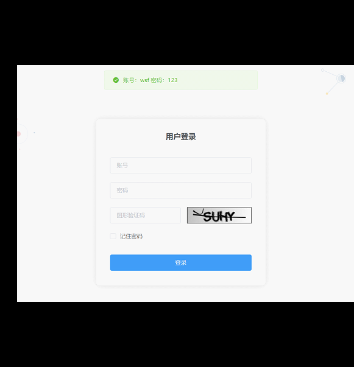

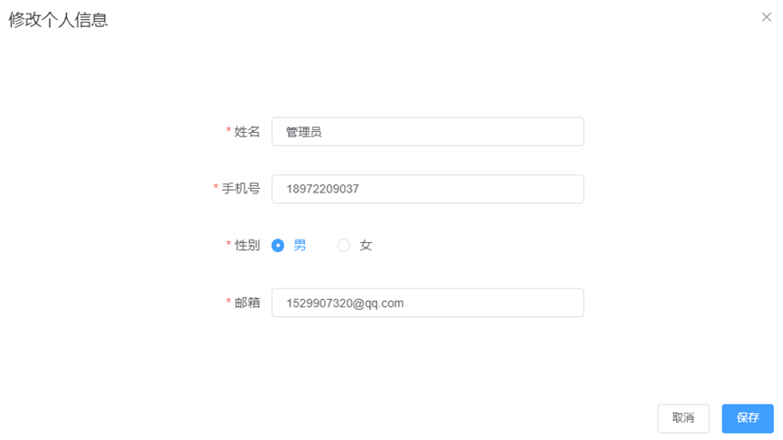

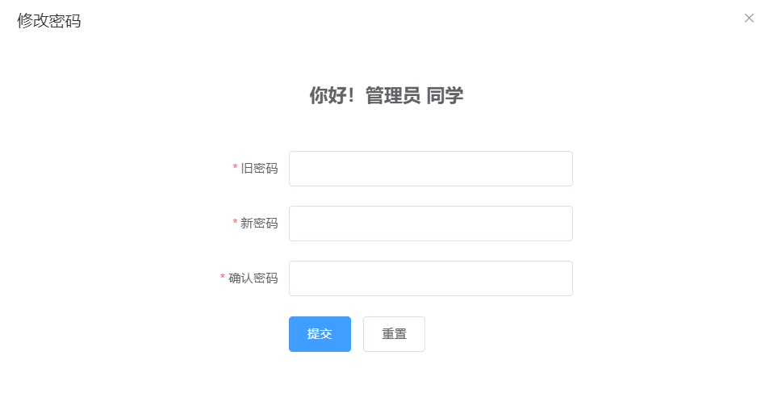

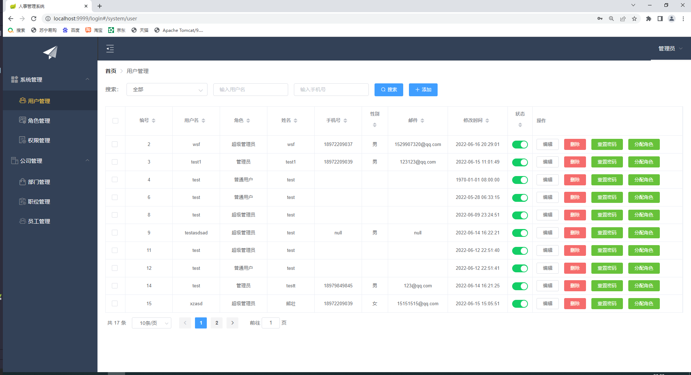

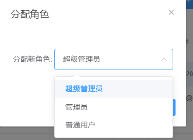

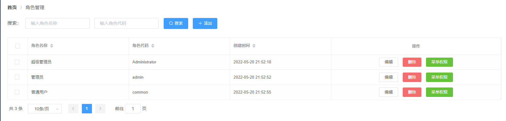

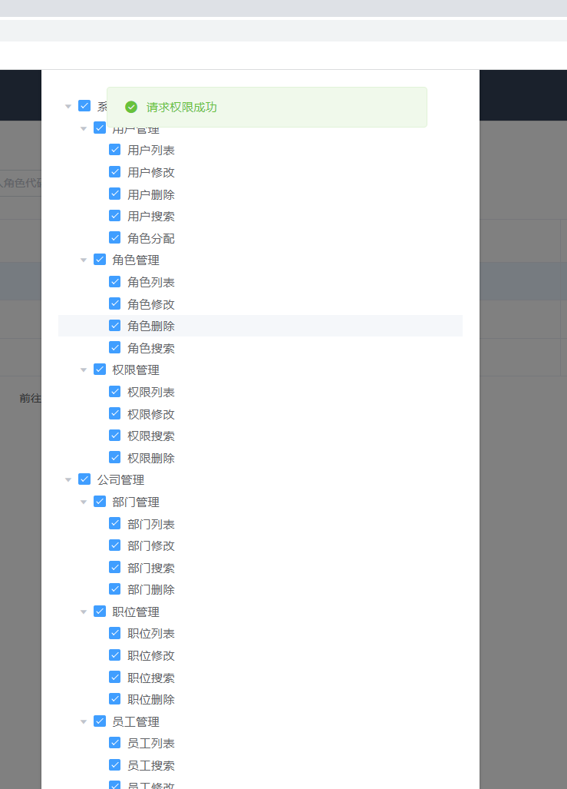

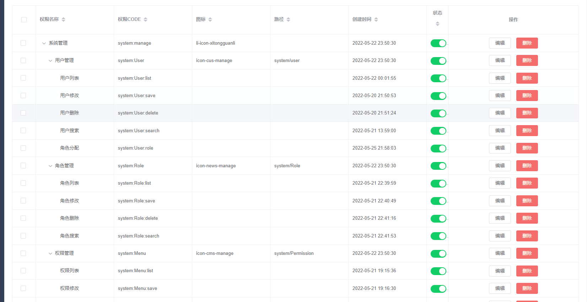

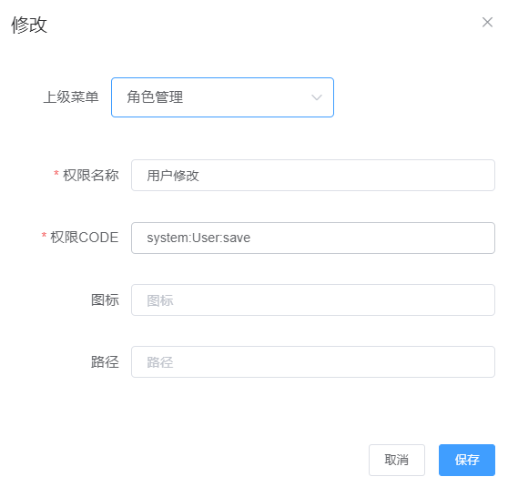

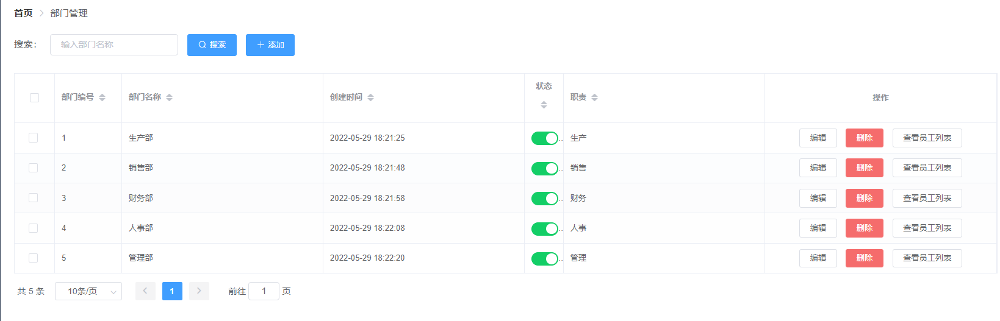

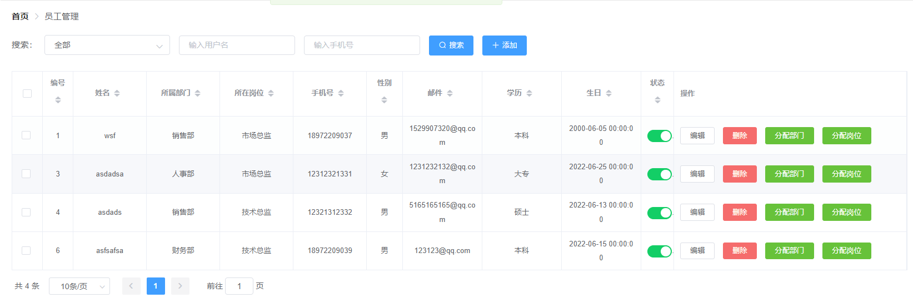

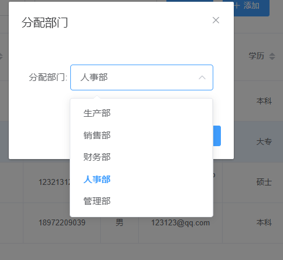
